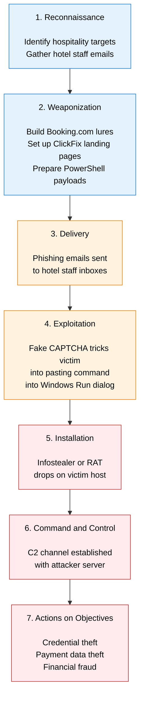

# Storm-1865: Hospitality Phishing Campaign

**Author:** Maryam Fatima A

**Public reference:** Microsoft MSTIC blog on Storm-1865, March 2025

Storm-1865 is a financially motivated threat actor cluster tracked by Microsoft. The campaign impersonates Booking.com to target the hospitality sector, using a social engineering technique called ClickFix to trick hotel staff into running malicious commands. Goal: credential theft and financial fraud.

This is an analysis of 812 phishing URLs across 770 domains tied to the campaign. Seven were found leaking real victim PII directly in the URL, which confirms live compromise.

## Cyber Kill Chain

## How the attack works

A hotel staff member gets an email styled as a Booking.com notification, usually about a reservation issue, payment verification, or a guest review. The link goes to a page that looks like the real Booking.com site. Instead of stealing credentials directly, the page shows a fake CAPTCHA that walks the victim through pasting a command into the Windows Run dialog. The user thinks they are completing a routine bot check. The pasted command is actually PowerShell or cmd that fetches and runs an infostealer or RAT in the background.

This is the ClickFix technique. It works because the malicious execution happens on the victim's own machine through their own input. Email security never sees the command because the command never travels in the email.

## Key findings

Of the 812 URLs I went through, 198 used the `booking.` subdomain trick where the URL starts with the brand name but the actual domain underneath is something completely different. That was the most common impersonation pattern by a wide margin. Others used typosquats (`booklng`, `bookng`), Punycode characters that mimic real letters, and number-for-letter swaps like `h0tel` and `appr0ve`.

The infrastructure looks automated. Path structures repeat heavily, randomised subdomains sit on shared hosting, and 83 URLs carry a `?t=g` parameter that looks like campaign analytics, probably the operators A/B testing which lures get the best click-through. Five high-reuse domains alone account for over 40 URLs between them.

Seven URLs were found with real victim names, emails and phone numbers sitting in the query strings. That is the strongest evidence in the dataset that real guests have already been compromised.

## Recommendations

The 770 domains should be ingested into email security, DNS filtering, and firewall blocklists straight away. MFA should be enabled across all reservation and loyalty platforms. Staff awareness sessions should use real examples from this campaign, because ClickFix is unusual enough that people need to see it walked through to recognise it, and generic phishing slides will not really land.

It is also worth checking that guest-facing booking flows do not expose PII in URL query strings. Seven URLs in this dataset did exactly that.

## Notes

Based on publicly available threat intelligence and OSINT. No employer-proprietary data included. Shared under TLP:CLEAR. The technical companion report has the full IOC list, MITRE ATT&CK mapping, and YARA hunting rule.
